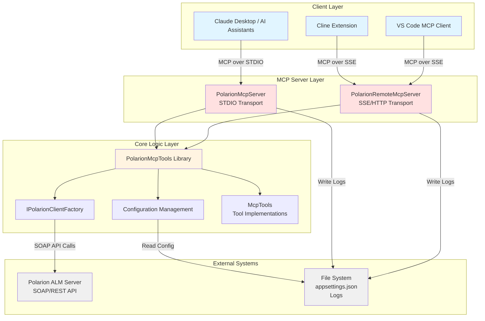
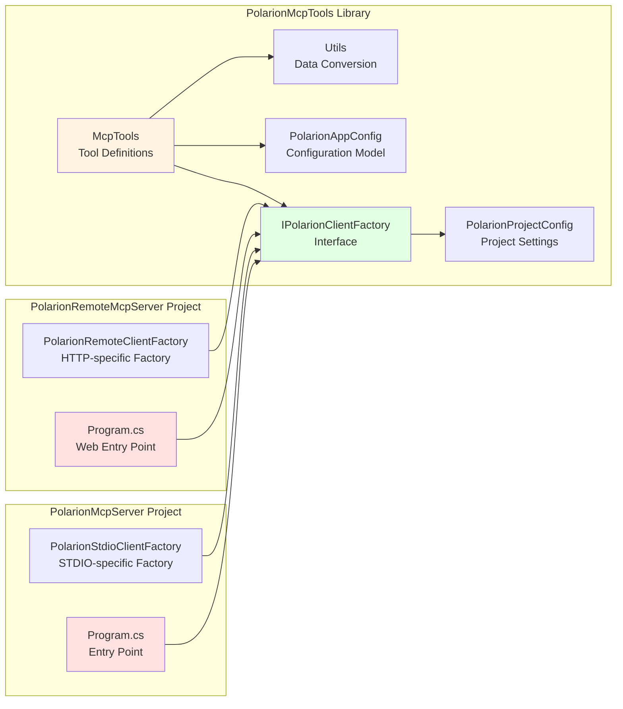
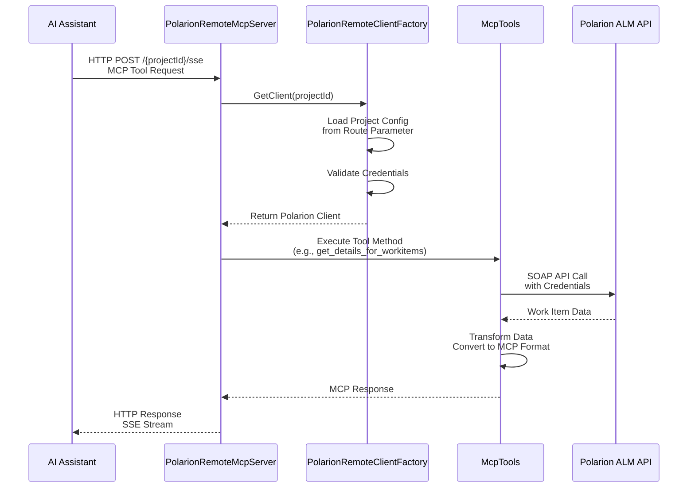
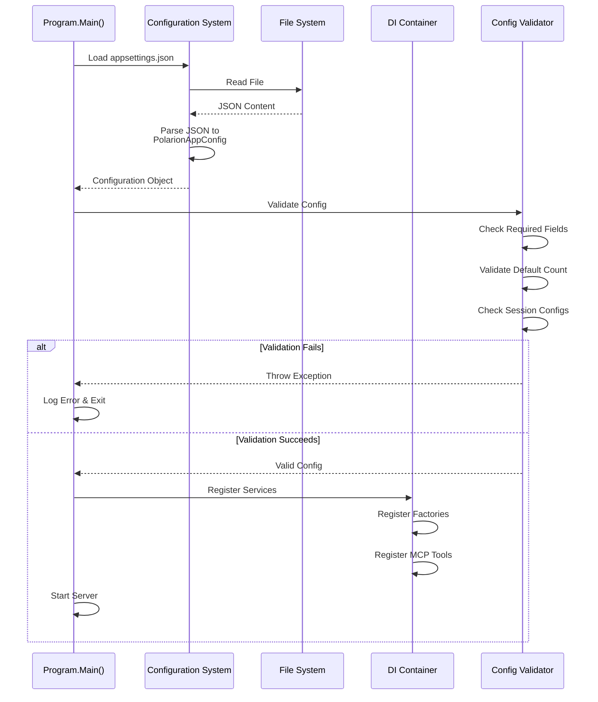
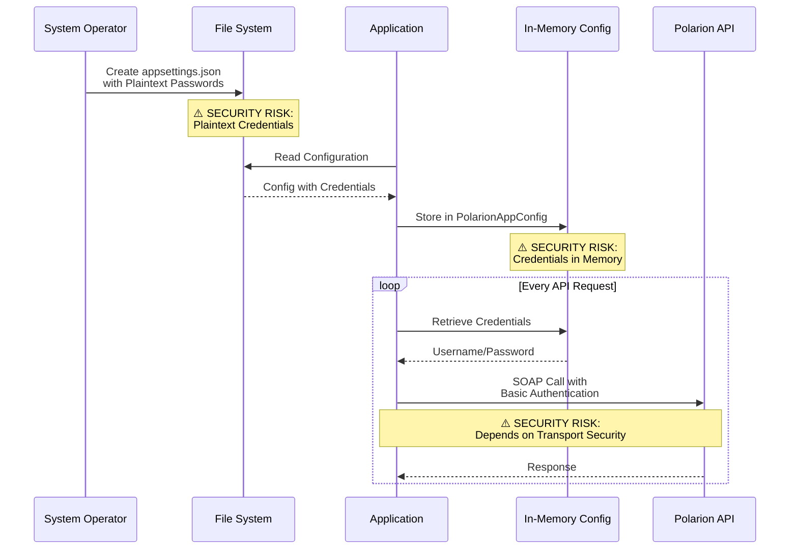
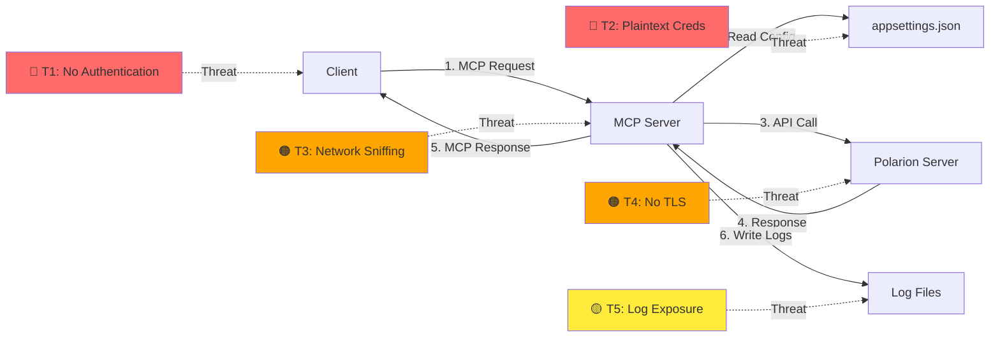

# Security Threat Model - Polarion MCP Servers

**Document Version:** 1.0  
**Date:** October 2024  
**Status:** Initial Assessment

---

## Executive Summary

This document provides a comprehensive security threat assessment for the Polarion MCP Servers project. The system provides Model Context Protocol (MCP) server implementations for Polarion Application Lifecycle Management (ALM) integration, enabling AI assistants to interact with Polarion work items, documents, and project data.

**Critical Security Findings:**
- Plaintext credentials stored in configuration files (HIGH RISK)
- HTTP transport without encryption support documented (MEDIUM RISK)
- No authentication/authorization layer for MCP endpoints (HIGH RISK)
- Direct database access patterns without input sanitization checks (MEDIUM RISK)

---

## 1. System Requirements

### 1.1 Functional Requirements

#### FR-1: Multi-Project Support
- Support multiple Polarion project configurations
- Enable project-specific custom field definitions
- Route requests to appropriate Polarion instances

#### FR-2: Work Item Operations
- Retrieve work item details and text content
- Query custom fields for specific work item types
- Search work items within documents

#### FR-3: Document Operations
- List and filter documents by title or space
- Retrieve document sections and content
- Navigate document hierarchies

#### FR-4: Configuration Management
- Support multiple deployment modes (STDIO, SSE/HTTP)
- Load configuration from appsettings.json
- Support command-line configuration overrides

#### FR-5: MCP Protocol Compliance
- Implement Model Context Protocol server specification
- Support STDIO transport (local mode)
- Support SSE transport over HTTP (remote mode)

### 1.2 Non-Functional Requirements

#### NFR-1: Security
- Protect sensitive configuration data (credentials)
- Secure communication channels
- Implement access control for MCP endpoints
- Audit logging of access attempts

#### NFR-2: Reliability
- Handle connection timeouts gracefully
- Validate configuration on startup
- Provide clear error messages

#### NFR-3: Performance
- Support concurrent requests in remote mode
- Optimize Polarion API calls
- Implement connection pooling where appropriate

#### NFR-4: Maintainability
- Clear separation of concerns (Tools, Server, Config)
- Comprehensive logging with Serilog
- Dependency injection architecture

#### NFR-5: Deployment
- Docker containerization support
- Multi-platform support (Windows, Linux)
- Minimal external dependencies

---

## 2. Software Architecture

### 2.1 System Architecture - Block Diagram



### 2.2 Component Architecture



### 2.3 Data Flow - Sequence Diagrams

#### 2.3.1 MCP Tool Request Flow (Remote Mode)



#### 2.3.2 Configuration Loading Flow



#### 2.3.3 Credential Flow (Security Critical)



---

## 3. Threat Assessment Model (STRIDE Analysis)

### 3.1 STRIDE Methodology Overview

STRIDE is a threat modeling framework that categorizes threats into six types:
- **S**poofing Identity
- **T**ampering with Data
- **R**epudiation
- **I**nformation Disclosure
- **D**enial of Service
- **E**levation of Privilege

### 3.2 Threat Identification by Component

#### 3.2.1 Configuration Storage (appsettings.json)

| Threat Type | Threat Description | Risk Level | Attack Vector | Impact |
|-------------|-------------------|------------|---------------|--------|
| **Information Disclosure** | Plaintext credentials stored in appsettings.json | 🔴 **CRITICAL** | File system access, backup exposure, version control leak | Complete compromise of Polarion access |
| **Tampering** | Unauthorized modification of configuration | 🟠 **HIGH** | File system write access | Redirect to malicious Polarion instance, inject credentials |
| **Information Disclosure** | Example credentials in README.md | 🟡 **MEDIUM** | Public repository access | Credential patterns, potential password reuse |
| **Denial of Service** | Invalid configuration causes startup failure | 🟡 **MEDIUM** | Configuration corruption | Service unavailability |

**Current Controls:**
- ⚠️ Warning message in documentation about plaintext passwords
- Configuration validation on startup

**Recommended Mitigations:**
1. ✅ Implement Azure Key Vault integration
2. ✅ Support .NET User Secrets for development
3. ✅ Support environment variables for credentials
4. ✅ Implement configuration encryption at rest
5. ✅ Add .gitignore rules for appsettings.*.json files
6. ✅ Remove example credentials from public documentation
7. ✅ Implement secrets scanning in CI/CD pipeline

---

#### 3.2.2 PolarionRemoteMcpServer (HTTP/SSE Endpoint)

| Threat Type | Threat Description | Risk Level | Attack Vector | Impact |
|-------------|-------------------|------------|---------------|--------|
| **Spoofing** | No authentication on MCP endpoints | 🔴 **CRITICAL** | Direct HTTP requests to /{projectId}/sse | Unauthorized access to Polarion data |
| **Information Disclosure** | Sensitive data exposed over unencrypted HTTP | 🟠 **HIGH** | Network sniffing | Exposure of work items, documents, credentials in transit |
| **Tampering** | MCP requests can be intercepted and modified | 🟠 **HIGH** | Man-in-the-middle attack | Data manipulation, credential theft |
| **Denial of Service** | No rate limiting on endpoints | 🟠 **HIGH** | Automated request flooding | Service exhaustion, Polarion API quota consumption |
| **Elevation of Privilege** | All clients have same access level | 🟠 **HIGH** | Any authenticated client | Full access to all configured projects |
| **Repudiation** | No audit logging of MCP requests | 🟡 **MEDIUM** | Any client action | Cannot track who accessed what data |

**Current Controls:**
- None identified

**Recommended Mitigations:**
1. ✅ Implement API key authentication for MCP clients
2. ✅ Add HTTPS/TLS support with certificate validation
3. ✅ Implement rate limiting per client/IP
4. ✅ Add request/response audit logging with client identification
5. ✅ Implement role-based access control (RBAC) for project access
6. ✅ Add IP whitelisting configuration option
7. ✅ Implement request signing to prevent tampering
8. ✅ Add CORS policy configuration

---

#### 3.2.3 PolarionMcpServer (STDIO Mode)

| Threat Type | Threat Description | Risk Level | Attack Vector | Impact |
|-------------|-------------------|------------|---------------|--------|
| **Spoofing** | Launched by untrusted parent process | 🟠 **HIGH** | Process injection, malicious launcher | Unauthorized Polarion access |
| **Elevation of Privilege** | Inherits parent process privileges | 🟡 **MEDIUM** | Run by elevated account | Unnecessary elevated access to Polarion |
| **Information Disclosure** | Logs may contain sensitive data | 🟡 **MEDIUM** | Log file access | Credential leakage, data exposure |
| **Denial of Service** | Resource exhaustion from parent process | 🟡 **MEDIUM** | Malicious STDIO commands | Service crash, memory exhaustion |

**Current Controls:**
- Process boundary isolation
- Serilog structured logging

**Recommended Mitigations:**
1. ✅ Implement parent process validation
2. ✅ Add log sanitization to remove sensitive data
3. ✅ Implement resource limits (memory, CPU)
4. ✅ Add input validation on STDIO messages
5. ✅ Run with least privilege principle
6. ✅ Secure log file permissions (read-only for operators)

---

#### 3.2.4 Polarion API Client Integration

| Threat Type | Threat Description | Risk Level | Attack Vector | Impact |
|-------------|-------------------|------------|---------------|--------|
| **Tampering** | SOAP requests can be modified | 🟠 **HIGH** | Man-in-the-middle on Polarion connection | Data corruption in Polarion |
| **Information Disclosure** | Credentials sent in SOAP headers | 🟠 **HIGH** | Network interception | Credential theft if not HTTPS |
| **Spoofing** | No certificate validation documented | 🟠 **HIGH** | Rogue Polarion server | Connect to malicious endpoint |
| **Denial of Service** | No timeout or retry limits on API calls | 🟡 **MEDIUM** | Slow/unavailable Polarion server | Service hang, resource exhaustion |
| **Information Disclosure** | API responses may contain sensitive data | 🟡 **MEDIUM** | Memory dumps, debug logs | Exposure of work item content |

**Current Controls:**
- Configurable timeout (TimeoutSeconds parameter)
- SOAP protocol built-in structure

**Recommended Mitigations:**
1. ✅ Enforce HTTPS for all Polarion connections
2. ✅ Implement SSL/TLS certificate validation
3. ✅ Add certificate pinning for known Polarion servers
4. ✅ Implement connection pooling with secure cleanup
5. ✅ Add retry logic with exponential backoff
6. ✅ Sanitize API responses before logging
7. ✅ Implement circuit breaker pattern for resilience

---

#### 3.2.5 Docker Container Deployment

| Threat Type | Threat Description | Risk Level | Attack Vector | Impact |
|-------------|-------------------|------------|---------------|--------|
| **Information Disclosure** | Secrets in container environment variables | 🟠 **HIGH** | Docker inspect, container escape | Credential exposure |
| **Elevation of Privilege** | Container running as root | 🟠 **HIGH** | Container escape vulnerability | Host system compromise |
| **Tampering** | Unsigned container images | 🟡 **MEDIUM** | Malicious image substitution | Compromised application |
| **Denial of Service** | No resource limits on container | 🟡 **MEDIUM** | Resource exhaustion | Host system impact |
| **Information Disclosure** | Volume-mounted config files world-readable | 🟡 **MEDIUM** | Container access | Credential exposure |

**Current Controls:**
- Volume mounting for configuration
- .NET 9 base image from Microsoft

**Recommended Mitigations:**
1. ✅ Run container as non-root user
2. ✅ Implement Docker secrets instead of volume mounts
3. ✅ Add resource limits (CPU, memory) to container
4. ✅ Sign container images and enable content trust
5. ✅ Use read-only root filesystem
6. ✅ Implement container security scanning in CI/CD
7. ✅ Use minimal base image (distroless or alpine)
8. ✅ Enable Docker security options (no-new-privileges, seccomp)

---

### 3.3 Data Flow Threats



---

## 4. Risk Assessment Matrix

### 4.1 Risk Scoring

| Risk Level | Likelihood | Impact | Priority |
|------------|-----------|--------|----------|
| 🔴 **CRITICAL** | High | High | P0 - Immediate |
| 🟠 **HIGH** | High | Medium OR Medium | High | P1 - Next Sprint |
| 🟡 **MEDIUM** | Medium | Medium | P2 - Backlog |
| 🟢 **LOW** | Low | Low | P3 - Future |

### 4.2 Prioritized Threat List

| # | Threat | Component | Risk | Priority | Effort |
|---|--------|-----------|------|----------|--------|
| 1 | Plaintext credentials in config | Configuration | 🔴 CRITICAL | P0 | Medium |
| 2 | No authentication on HTTP endpoints | RemoteMcpServer | 🔴 CRITICAL | P0 | High |
| 3 | No HTTPS/TLS support documented | RemoteMcpServer | 🟠 HIGH | P1 | Medium |
| 4 | No certificate validation for Polarion API | API Client | 🟠 HIGH | P1 | Low |
| 5 | Container running as root | Docker | 🟠 HIGH | P1 | Low |
| 6 | No rate limiting | RemoteMcpServer | 🟠 HIGH | P1 | Medium |
| 7 | Example credentials in README | Documentation | 🟡 MEDIUM | P2 | Low |
| 8 | No audit logging | All Components | 🟡 MEDIUM | P2 | Medium |
| 9 | Sensitive data in logs | Logging | 🟡 MEDIUM | P2 | Low |
| 10 | No input validation on MCP tools | McpTools | 🟡 MEDIUM | P2 | High |

---

## 5. Security Controls and Recommendations

### 5.1 Immediate Actions (P0 - Critical)

#### 5.1.1 Implement Secure Credential Storage

**Current State:**
```json
{
  "SessionConfig": {
    "Username": "shared_user",
    "Password": "linear-Vietnam-FLIP-212824"
  }
}
```

**Recommended Implementation:**

```csharp
// Support multiple credential sources with priority
public class SecureConfigurationProvider
{
    public PolarionClientConfiguration GetConfiguration(string projectAlias)
    {
        var config = LoadBaseConfig(projectAlias);
        
        // Priority 1: Environment Variables
        config.Username = Environment.GetEnvironmentVariable($"POLARION_{projectAlias}_USERNAME") 
                         ?? config.Username;
        config.Password = Environment.GetEnvironmentVariable($"POLARION_{projectAlias}_PASSWORD") 
                         ?? config.Password;
        
        // Priority 2: Azure Key Vault (if configured)
        if (!string.IsNullOrEmpty(keyVaultUrl))
        {
            config.Password = await GetFromKeyVault($"polarion-{projectAlias}-password");
        }
        
        // Priority 3: User Secrets (development only)
        #if DEBUG
        config.Password = userSecrets[$"Polarion:{projectAlias}:Password"];
        #endif
        
        return config;
    }
}
```

**Docker Compose with Secrets:**
```yaml
version: '3.8'
services:
  polarion-mcp:
    image: polarion-remote-mcp-server
    secrets:
      - polarion_username
      - polarion_password
    environment:
      - POLARION_starlight_USERNAME_FILE=/run/secrets/polarion_username
      - POLARION_starlight_PASSWORD_FILE=/run/secrets/polarion_password

secrets:
  polarion_username:
    external: true
  polarion_password:
    external: true
```

---

#### 5.1.2 Implement API Authentication

**Add API Key Middleware:**

```csharp
public class ApiKeyAuthenticationMiddleware
{
    private readonly RequestDelegate _next;
    private readonly IConfiguration _configuration;
    
    public async Task InvokeAsync(HttpContext context)
    {
        // Check for API key in header
        if (!context.Request.Headers.TryGetValue("X-API-Key", out var apiKey))
        {
            context.Response.StatusCode = 401;
            await context.Response.WriteAsJsonAsync(new { error = "API key required" });
            return;
        }
        
        // Validate API key against configured keys
        var validKeys = _configuration.GetSection("ApiKeys").Get<List<ApiKeyConfig>>();
        var keyConfig = validKeys?.FirstOrDefault(k => k.Key == apiKey);
        
        if (keyConfig == null)
        {
            context.Response.StatusCode = 401;
            await context.Response.WriteAsJsonAsync(new { error = "Invalid API key" });
            return;
        }
        
        // Store client identity for audit logging
        context.Items["ClientId"] = keyConfig.ClientId;
        context.Items["AllowedProjects"] = keyConfig.AllowedProjects;
        
        await _next(context);
    }
}

public class ApiKeyConfig
{
    public string Key { get; set; }
    public string ClientId { get; set; }
    public List<string> AllowedProjects { get; set; }
    public DateTime? Expiration { get; set; }
}
```

**Configuration:**
```json
{
  "ApiKeys": [
    {
      "Key": "ak_live_1234567890abcdef",
      "ClientId": "claude-desktop-user1",
      "AllowedProjects": ["starlight", "octopus"],
      "Expiration": "2025-12-31T23:59:59Z"
    }
  ]
}
```

---

### 5.2 High Priority Actions (P1)

#### 5.2.1 Enable HTTPS/TLS

**Update Program.cs:**
```csharp
var builder = WebApplication.CreateBuilder(args);

// Configure Kestrel for HTTPS
builder.WebHost.ConfigureKestrel(options =>
{
    options.Listen(IPAddress.Any, 8080); // HTTP (redirect to HTTPS)
    options.Listen(IPAddress.Any, 8443, listenOptions =>
    {
        listenOptions.UseHttps(httpsOptions =>
        {
            // Load certificate from configuration
            var certPath = builder.Configuration["Https:CertificatePath"];
            var certPassword = builder.Configuration["Https:CertificatePassword"];
            httpsOptions.ServerCertificate = new X509Certificate2(certPath, certPassword);
        });
    });
});

// Add HTTPS redirection
app.UseHttpsRedirection();
```

#### 5.2.2 Implement Rate Limiting

```csharp
builder.Services.AddRateLimiter(options =>
{
    options.GlobalLimiter = PartitionedRateLimiter.Create<HttpContext, string>(context =>
    {
        var clientId = context.Items["ClientId"]?.ToString() ?? 
                       context.Connection.RemoteIpAddress?.ToString() ?? 
                       "anonymous";
        
        return RateLimitPartition.GetFixedWindowLimiter(clientId, key => 
            new FixedWindowRateLimiterOptions
            {
                PermitLimit = 100,
                Window = TimeSpan.FromMinutes(1),
                QueueProcessingOrder = QueueProcessingOrder.OldestFirst,
                QueueLimit = 10
            });
    });
});

app.UseRateLimiter();
```

#### 5.2.3 Add Certificate Validation for Polarion API

```csharp
public class SecurePolarionClientFactory : IPolarionClientFactory
{
    public PolarionService GetClient(string projectId)
    {
        var config = GetProjectConfig(projectId);
        
        // Configure HTTP client with certificate validation
        var handler = new HttpClientHandler
        {
            ServerCertificateCustomValidationCallback = (message, cert, chain, errors) =>
            {
                // Option 1: Certificate pinning
                if (config.CertificateThumbprint != null)
                {
                    return cert.Thumbprint == config.CertificateThumbprint;
                }
                
                // Option 2: Standard validation with custom root CA
                if (config.CustomRootCA != null)
                {
                    chain.ChainPolicy.ExtraStore.Add(new X509Certificate2(config.CustomRootCA));
                }
                
                // Require valid certificate
                return errors == SslPolicyErrors.None;
            }
        };
        
        // Create Polarion client with secure transport
        var client = new PolarionService(config.ServerUrl, handler);
        return client;
    }
}
```

---

### 5.3 Medium Priority Actions (P2)

#### 5.3.1 Implement Audit Logging

```csharp
public class AuditLoggingMiddleware
{
    private readonly RequestDelegate _next;
    private readonly ILogger<AuditLoggingMiddleware> _logger;
    
    public async Task InvokeAsync(HttpContext context)
    {
        var stopwatch = Stopwatch.StartNew();
        var clientId = context.Items["ClientId"]?.ToString() ?? "anonymous";
        var projectId = context.GetRouteValue("projectId")?.ToString();
        
        try
        {
            await _next(context);
            
            stopwatch.Stop();
            
            _logger.LogInformation(
                "MCP Request: Client={ClientId}, Project={ProjectId}, Path={Path}, " +
                "Method={Method}, StatusCode={StatusCode}, Duration={Duration}ms",
                clientId, projectId, context.Request.Path, context.Request.Method,
                context.Response.StatusCode, stopwatch.ElapsedMilliseconds);
        }
        catch (Exception ex)
        {
            _logger.LogError(ex,
                "MCP Request Failed: Client={ClientId}, Project={ProjectId}, Path={Path}",
                clientId, projectId, context.Request.Path);
            throw;
        }
    }
}
```

#### 5.3.2 Sanitize Logs to Remove Sensitive Data

```csharp
public class SensitiveDataFilter : ILogEventFilter
{
    private static readonly Regex PasswordPattern = new Regex(
        @"(?i)(password|pwd|secret|token|apikey)[""']?\s*[:=]\s*[""']?([^""',}\s]+)",
        RegexOptions.Compiled);
    
    public bool IsEnabled(LogEvent logEvent)
    {
        if (logEvent.MessageTemplate.Text.Contains("Password") ||
            logEvent.MessageTemplate.Text.Contains("SessionConfig"))
        {
            // Redact sensitive properties
            foreach (var prop in logEvent.Properties)
            {
                if (prop.Key.Contains("Password", StringComparison.OrdinalIgnoreCase) ||
                    prop.Key.Contains("ApiKey", StringComparison.OrdinalIgnoreCase))
                {
                    logEvent.AddOrUpdateProperty(new LogEventProperty(
                        prop.Key, 
                        new ScalarValue("***REDACTED***")));
                }
            }
        }
        
        return true;
    }
}
```

#### 5.3.3 Input Validation for MCP Tools

```csharp
public partial class McpTools
{
    [McpTool(Description = "Get details for specified work items by ID")]
    public async Task<string> GetDetailsForWorkItems(
        [Description("Comma-separated list of work item IDs")] string workItemIds)
    {
        // Input validation
        if (string.IsNullOrWhiteSpace(workItemIds))
        {
            throw new ArgumentException("Work item IDs cannot be empty");
        }
        
        var ids = workItemIds.Split(',', StringSplitOptions.RemoveEmptyEntries)
                             .Select(id => id.Trim())
                             .ToArray();
        
        // Validate format (e.g., PROJECT-123)
        var invalidIds = ids.Where(id => !Regex.IsMatch(id, @"^[A-Z0-9]+-\d+$")).ToArray();
        if (invalidIds.Any())
        {
            throw new ArgumentException($"Invalid work item ID format: {string.Join(", ", invalidIds)}");
        }
        
        // Limit number of IDs to prevent DoS
        if (ids.Length > 100)
        {
            throw new ArgumentException("Maximum 100 work items can be queried at once");
        }
        
        // Proceed with validated input
        return await GetDetailsForWorkItemsInternal(ids);
    }
}
```

---

### 5.4 Docker Security Hardening

**Improved Dockerfile:**
```dockerfile
# Use minimal base image
FROM mcr.microsoft.com/dotnet/aspnet:9.0-alpine AS base

# Create non-root user
RUN addgroup -S appgroup && adduser -S appuser -G appgroup

# Set working directory
WORKDIR /app
RUN chown appuser:appgroup /app

# Copy published application
COPY --chown=appuser:appgroup ./publish .

# Use non-root user
USER appuser

# Expose port
EXPOSE 8080

# Health check
HEALTHCHECK --interval=30s --timeout=3s --start-period=5s --retries=3 \
    CMD wget --no-verbose --tries=1 --spider http://localhost:8080/health || exit 1

# Set read-only root filesystem (exceptions for writable paths)
VOLUME ["/app/logs"]

ENTRYPOINT ["dotnet", "PolarionRemoteMcpServer.dll"]
```

**Docker Compose with Security Options:**
```yaml
version: '3.8'
services:
  polarion-mcp:
    image: polarion-remote-mcp-server:latest
    security_opt:
      - no-new-privileges:true
    cap_drop:
      - ALL
    cap_add:
      - NET_BIND_SERVICE
    read_only: true
    tmpfs:
      - /tmp
    volumes:
      - ./logs:/app/logs
    deploy:
      resources:
        limits:
          cpus: '1.0'
          memory: 512M
        reservations:
          cpus: '0.5'
          memory: 256M
```

---

## 6. Security Testing Recommendations

### 6.1 Automated Security Testing

#### 6.1.1 SAST (Static Application Security Testing)
- **Tool:** SonarQube or Snyk Code
- **Integration:** GitHub Actions workflow
- **Frequency:** Every commit to main branch

```yaml
# .github/workflows/security-scan.yml
name: Security Scan
on: [push, pull_request]
jobs:
  sast:
    runs-on: ubuntu-latest
    steps:
      - uses: actions/checkout@v3
      - name: Run Snyk Security Scan
        uses: snyk/actions/dotnet@master
        env:
          SNYK_TOKEN: ${{ secrets.SNYK_TOKEN }}
```

#### 6.1.2 Dependency Scanning
- **Tool:** Dependabot, Snyk, or WhiteSource
- **Check:** NuGet packages for known vulnerabilities
- **Frequency:** Weekly

#### 6.1.3 Container Security Scanning
- **Tool:** Trivy, Clair, or Anchore
- **Target:** Docker images before deployment

```bash
trivy image --severity HIGH,CRITICAL polarion-remote-mcp-server:latest
```

#### 6.1.4 Secrets Scanning
- **Tool:** GitGuardian or TruffleHog
- **Target:** Repository history and commits
- **Integration:** Pre-commit hooks

```yaml
# .pre-commit-config.yaml
repos:
  - repo: https://github.com/trufflesecurity/trufflehog
    rev: main
    hooks:
      - id: trufflehog
```

### 6.2 Manual Security Testing

#### 6.2.1 Penetration Testing Checklist

**Authentication & Authorization:**
- [ ] Test API without authentication
- [ ] Test with invalid API keys
- [ ] Test with expired API keys
- [ ] Test cross-project access control
- [ ] Test privilege escalation attempts

**Input Validation:**
- [ ] SQL injection attempts (if applicable)
- [ ] Command injection in work item IDs
- [ ] Path traversal in document queries
- [ ] XML/SOAP injection in Polarion API calls
- [ ] Large payload handling (DoS)

**Network Security:**
- [ ] Test HTTP to HTTPS redirection
- [ ] Verify TLS certificate validation
- [ ] Test for SSL/TLS vulnerabilities (weak ciphers)
- [ ] Verify CORS policy enforcement

**Configuration Security:**
- [ ] Test with missing configuration
- [ ] Test with malformed configuration
- [ ] Verify credential exposure in error messages
- [ ] Test configuration reload scenarios

---

## 7. Incident Response Plan

### 7.1 Security Incident Classification

| Severity | Description | Examples | Response Time |
|----------|-------------|----------|---------------|
| **P0 - Critical** | Active exploitation, data breach | Credential compromise, unauthorized data access | < 1 hour |
| **P1 - High** | Vulnerability with high impact | Unpatched critical CVE, config exposure | < 4 hours |
| **P2 - Medium** | Potential security issue | Suspicious activity, failed auth attempts | < 24 hours |
| **P3 - Low** | Security hygiene | Log anomalies, outdated dependencies | < 1 week |

### 7.2 Response Procedures

#### 7.2.1 Credential Compromise
1. **Immediate Actions (< 15 minutes):**
   - Rotate all compromised Polarion credentials
   - Revoke all API keys
   - Shut down affected MCP server instances

2. **Investigation (< 1 hour):**
   - Review audit logs for unauthorized access
   - Identify scope of data exposure
   - Determine attack vector

3. **Remediation (< 4 hours):**
   - Deploy patched configuration with new credentials
   - Notify affected users
   - Document incident

4. **Post-Incident (< 1 week):**
   - Root cause analysis
   - Implement preventive measures
   - Update security documentation

---

## 8. Compliance and Regulatory Considerations

### 8.1 Data Protection

**GDPR Considerations (if applicable):**
- Work items may contain personal data (usernames, emails)
- Implement right to be forgotten for cached data
- Data processing agreements with Polarion administrators
- Audit logging for data access compliance

**HIPAA Considerations (if applicable in medical context):**
- Work items may contain Protected Health Information (PHI)
- Encryption in transit and at rest required
- Access controls and audit trails mandatory
- Business Associate Agreement (BAA) required

### 8.2 Industry Standards

**OWASP Top 10 Compliance:**
- [x] A01: Broken Access Control - **HIGH RISK** identified
- [x] A02: Cryptographic Failures - **HIGH RISK** identified  
- [x] A03: Injection - **MEDIUM RISK** identified
- [x] A07: Identification and Authentication Failures - **CRITICAL RISK** identified
- [x] A09: Security Logging and Monitoring Failures - **MEDIUM RISK** identified

**CIS Docker Benchmark:**
- [ ] Container images should be scanned
- [ ] Containers should run as non-root user
- [ ] Host file system should not be mounted read-write
- [ ] Resource limits should be enforced

---

## 9. Security Monitoring and Alerting

### 9.1 Metrics to Monitor

```csharp
// Example metrics using Prometheus
public class SecurityMetrics
{
    private static readonly Counter AuthFailures = Metrics.CreateCounter(
        "mcp_auth_failures_total",
        "Total number of authentication failures",
        new CounterConfiguration { LabelNames = new[] { "client_id", "reason" } });
    
    private static readonly Histogram RequestDuration = Metrics.CreateHistogram(
        "mcp_request_duration_seconds",
        "Duration of MCP requests",
        new HistogramConfiguration { LabelNames = new[] { "project", "tool" } });
    
    private static readonly Gauge ActiveConnections = Metrics.CreateGauge(
        "mcp_active_connections",
        "Number of active MCP connections");
    
    public static void RecordAuthFailure(string clientId, string reason)
    {
        AuthFailures.WithLabels(clientId, reason).Inc();
    }
}
```

### 9.2 Alert Conditions

| Alert | Condition | Severity | Action |
|-------|-----------|----------|--------|
| High Auth Failure Rate | > 10 failures/min from single IP | HIGH | Block IP, investigate |
| Credential Exposure | "password" in log files | CRITICAL | Rotate credentials, audit |
| Unusual Access Pattern | Access to > 1000 work items in 1 min | MEDIUM | Investigate client |
| Service Unavailable | No successful requests in 5 min | HIGH | Check Polarion connectivity |
| Resource Exhaustion | Memory > 90% for 5 min | MEDIUM | Scale or restart |

---

## 10. Secure Development Lifecycle (SDL)

### 10.1 Security Requirements in Development

**Pre-Commit:**
- Secrets scanning (TruffleHog, GitGuardian)
- Code formatting and linting
- Unit test execution

**Pull Request:**
- SAST scan (SonarQube, Snyk)
- Dependency vulnerability check
- Security-focused code review
- Test coverage check (> 70%)

**Pre-Deployment:**
- Container security scan (Trivy)
- Integration testing with security tests
- Configuration validation
- Credential rotation check

**Post-Deployment:**
- Health check validation
- Smoke tests
- Security monitoring activation
- Documentation update

### 10.2 Security Training

**Required Training for Developers:**
- OWASP Top 10 awareness
- Secure coding practices in C#/.NET
- Docker security best practices
- Secrets management
- Incident response procedures

---

## 11. Revision History

| Version | Date | Author | Changes |
|---------|------|--------|---------|
| 1.0 | 2024-10-06 | Security Assessment | Initial threat model creation |

---

## 12. References and Resources

### 12.1 Security Standards
- [OWASP Top 10 - 2021](https://owasp.org/www-project-top-ten/)
- [OWASP API Security Top 10](https://owasp.org/www-project-api-security/)
- [CIS Docker Benchmark](https://www.cisecurity.org/benchmark/docker)
- [NIST Cybersecurity Framework](https://www.nist.gov/cyberframework)

### 12.2 .NET Security
- [Microsoft Security Best Practices for .NET](https://docs.microsoft.com/en-us/dotnet/standard/security/)
- [ASP.NET Core Security](https://docs.microsoft.com/en-us/aspnet/core/security/)
- [.NET User Secrets](https://docs.microsoft.com/en-us/aspnet/core/security/app-secrets)

### 12.3 Container Security
- [Docker Security Best Practices](https://docs.docker.com/engine/security/)
- [Kubernetes Security Context](https://kubernetes.io/docs/tasks/configure-pod-container/security-context/)

### 12.4 Tools
- **SAST:** SonarQube, Snyk Code, Checkmarx
- **DAST:** OWASP ZAP, Burp Suite
- **Container Scanning:** Trivy, Clair, Anchore
- **Secrets Detection:** TruffleHog, GitGuardian, git-secrets
- **Dependency Scanning:** Dependabot, Snyk, WhiteSource

---

## Appendix A: Attack Scenarios

### Scenario 1: Credential Theft via Configuration File

**Attacker Profile:** Internal user with file system access  
**Attack Vector:** Read appsettings.json file  
**Impact:** Full access to Polarion system with all permissions of service account

**Attack Steps:**
1. Gain access to server/container hosting MCP server
2. Navigate to application directory
3. Read appsettings.json file
4. Extract plaintext credentials
5. Use credentials to access Polarion directly or via MCP server

**Mitigation:** Implement P0 recommendations for secure credential storage

---

### Scenario 2: Unauthorized API Access

**Attacker Profile:** External attacker with network access  
**Attack Vector:** Direct HTTP requests to MCP endpoints  
**Impact:** Unauthorized access to sensitive work items and documents

**Attack Steps:**
1. Discover MCP server endpoint (e.g., http://server:8080/starlight/sse)
2. Send crafted MCP requests without authentication
3. Retrieve sensitive project data
4. Potentially modify data if tool allows

**Mitigation:** Implement API key authentication and HTTPS

---

### Scenario 3: Man-in-the-Middle Attack

**Attacker Profile:** Network-level attacker (compromised network or malicious proxy)  
**Attack Vector:** Intercept HTTP traffic between client and MCP server  
**Impact:** Credential theft, data interception, data tampering

**Attack Steps:**
1. Position on network path between client and server
2. Intercept unencrypted HTTP traffic
3. Extract credentials from SOAP headers to Polarion
4. Capture sensitive work item data
5. Potentially modify requests/responses

**Mitigation:** Implement HTTPS/TLS with certificate validation

---

## Appendix B: Security Checklist for Deployment

### Pre-Deployment Security Checklist

**Configuration:**
- [ ] All credentials stored in secure vault (not appsettings.json)
- [ ] Example credentials removed from documentation
- [ ] API keys configured for all clients
- [ ] HTTPS enabled with valid certificate
- [ ] Certificate validation enabled for Polarion API
- [ ] Rate limiting configured
- [ ] CORS policy defined and enforced
- [ ] Log sanitization enabled
- [ ] Audit logging enabled

**Container:**
- [ ] Running as non-root user
- [ ] Resource limits defined
- [ ] Read-only root filesystem enabled
- [ ] Security options enabled (no-new-privileges)
- [ ] Health check configured
- [ ] Container image scanned for vulnerabilities
- [ ] Image signed and content trust enabled

**Network:**
- [ ] Firewall rules configured
- [ ] Only required ports exposed
- [ ] IP whitelisting configured (if applicable)
- [ ] TLS 1.2+ enforced
- [ ] Weak ciphers disabled

**Monitoring:**
- [ ] Security metrics being collected
- [ ] Alerts configured for security events
- [ ] Log aggregation configured
- [ ] Audit logs retained per policy
- [ ] Incident response plan in place

**Documentation:**
- [ ] Security runbook updated
- [ ] Credential rotation procedures documented
- [ ] Incident contacts defined
- [ ] Deployment architecture documented

---

**End of Security Threat Model Document**

*This document should be reviewed and updated quarterly or whenever significant changes are made to the system.*
